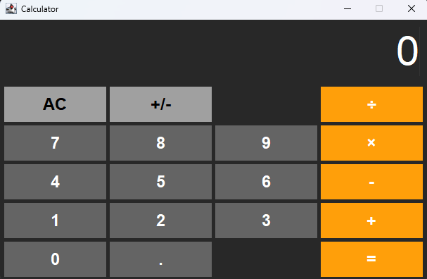

# Java Swing iPhone-Inspired Calculator

## Overview

This project is a desktop calculator application developed using Java Swing. It aims to replicate the user interface and core arithmetic functions found in the standard calculator app on iOS devices. It features a clean, dark-themed interface with distinct button styles for numbers, operators, and utility functions.

**(Optional: Add a screenshot of the calculator here!)**
<!--  -->


## Features

*   **Standard Arithmetic:** Addition (`+`), Subtraction (`-`), Multiplication (`×`), Division (`÷`).
*   **Utility Functions:**
    *   `AC`: All Clear - Resets the calculator state.
    *   `+/-`: Toggles the sign of the currently displayed number.
    *   `.`: Adds a decimal point for floating-point input.
*   **iPhone-like Styling:**
    *   Dark background theme.
    *   Color-coded buttons: Dark gray for numbers, light gray for top-row functions, orange for operators.
    *   Custom fonts for display and buttons.
*   **Display:**
    *   Large display area for numbers.
    *   Dynamic font size adjustment to fit longer numbers.
    *   Formatted output to avoid scientific notation and trailing zeros (up to a limit).
*   **Error Handling:** Basic handling for invalid operations like division by zero.

## Technology Used

*   **Language:** Java
*   **GUI Library:** Java Swing

## How to Run

1.  **Prerequisites:** Make sure you have a Java Development Kit (JDK) installed (version 8 or later recommended).
2.  **Save the Code:** Place the `IPhoneCalculator.java` file inside a directory named `IPhoneCalculator`.
3.  **Compile:** Open a terminal or command prompt, navigate to the directory *containing* the `IPhoneCalculator` folder, and run:
    ```bash
    javac IPhoneCalculator/IPhoneCalculator.java
    ```
4.  **Run:** Execute the compiled code using:
    ```bash
    java IPhoneCalculator.IPhoneCalculator
    ```
    This should launch the calculator window.

## Known Limitations

*   The layout uses `GridLayout`, so the '0' button does not span two columns like the actual iPhone calculator (which would require `GridBagLayout`).
*   Does not include advanced scientific functions or memory features.
*   The percentage (%) function was intentionally removed from this version.

## Screenshots

Here are a few glimpses of the calculator in action:

**Main Interface:**

